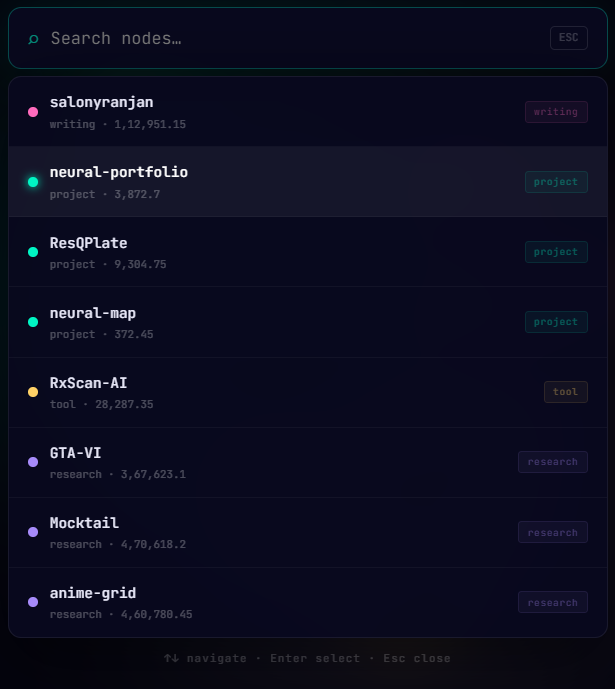
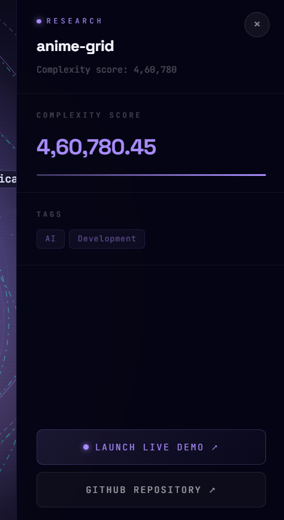
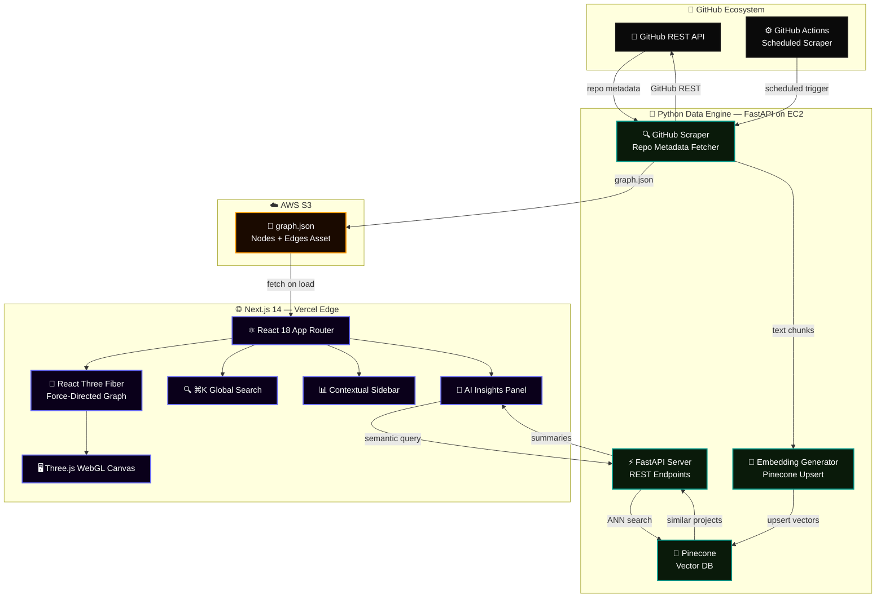
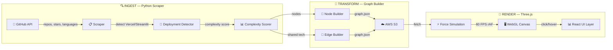
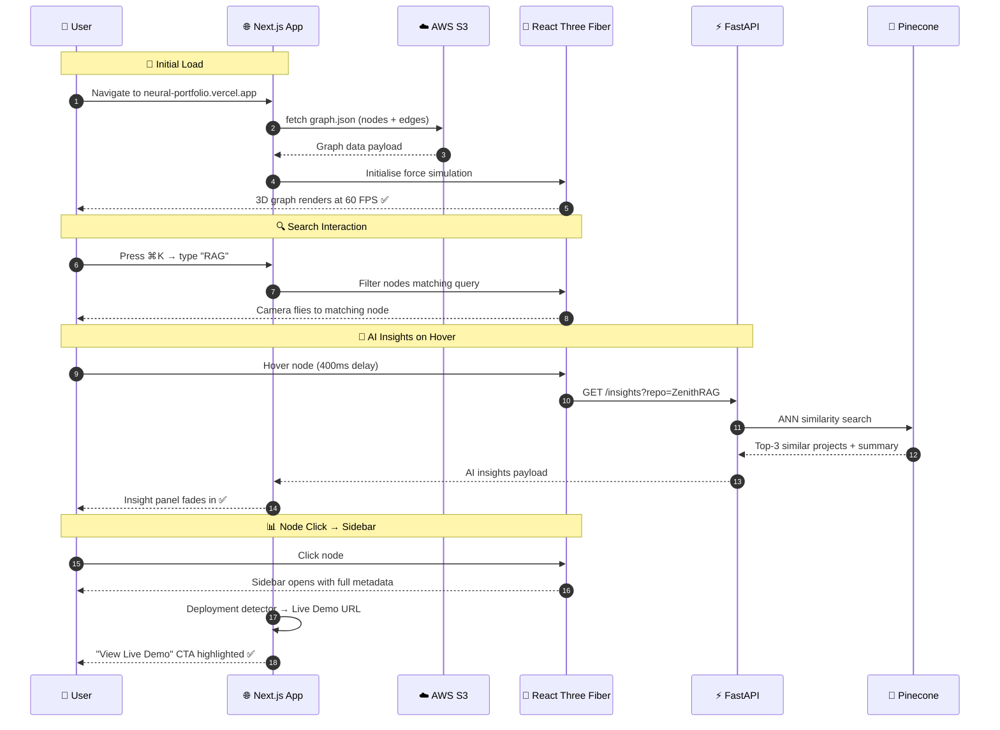

<div align="center">

<!-- ══════════════════════════════════════════════════════════════════ -->
<!--                        HERO BANNER                               -->
<!-- ══════════════════════════════════════════════════════════════════ -->


<br/>

<!-- ── Hero Image / Demo ── -->
<a href="https://neural-portfolio.vercel.app/" target="_blank">
  
</a>

<br/><br/>


<br/><br/>

<!-- ── Badges Row 1 — Status ── -->
[](https://github.com/SalonyRanjan/neural-portfolio/actions)
[](https://github.com/SalonyRanjan/neural-portfolio/releases)
[](LICENSE)
[](https://github.com/SalonyRanjan/neural-portfolio/stargazers)

<br/>

<!-- ── Badges Row 2 — Tech ── -->


<br/>


<br/>


<br/><br/>

> *"Not a résumé. Not a portfolio site. A living, breathing 3D knowledge graph that lets recruiters explore the relationships between skills, projects, and complexity — in real time."*

<br/>

<a href="https://neural-portfolio.vercel.app/"></a>
&nbsp;
<a href="#10--getting-started"></a>
&nbsp;
<a href="#5--architecture"></a>
&nbsp;
<a href="#9--roadmap"></a>

</div>

---

## 📋 Table of Contents

1. [🌌 What is Neural Portfolio?](#1--what-is-neural-portfolio)
2. [🖼️ Visual Showcase](#2-%EF%B8%8F-visual-showcase)
3. [📊 System at a Glance](#3--system-at-a-glance)
4. [✨ Key Features](#4--key-features)
5. [🏗️ Architecture](#5-%EF%B8%8F-architecture)
   - 5.1 [🔷 System Architecture Diagram](#51--system-architecture-diagram)
   - 5.2 [🔄 Data Flow — GitHub → Graph](#52--data-flow--github--graph)
   - 5.3 [⚡ Render Pipeline Sequence](#53--render-pipeline-sequence)
6. [🛠️ Tech Stack](#6-%EF%B8%8F-tech-stack)
   - 6.1 [🌐 Frontend & 3D Rendering](#61--frontend--3d-rendering)
   - 6.2 [🐍 Backend & Data Engine](#62--backend--data-engine)
   - 6.3 [☁️ Cloud & DevOps](#63-%EF%B8%8F-cloud--devops)
7. [🤔 Why I Built This](#7--why-i-built-this)
8. [📂 Project Structure](#8--project-structure)
9. [🗺️ Roadmap](#9-%EF%B8%8F-roadmap)
10. [📦 Getting Started](#10--getting-started)
    - 10.1 [🔧 Prerequisites](#101--prerequisites)
    - 10.2 [⬇️ Clone & Install](#102-%EF%B8%8F-clone--install)
    - 10.3 [🔑 Environment Variables](#103--environment-variables)
    - 10.4 [🖥️ Run Locally](#104-%EF%B8%8F-run-locally)
11. [🚀 Deployment](#11--deployment)
12. [⚡ Performance](#12--performance)
13. [🤝 Contributing](#13--contributing)
14. [❓ FAQ](#14--faq)
15. [📄 Changelog](#15--changelog)
16. [👤 Author](#16--author)
17. [⭐ Show Your Support](#17--show-your-support)

---

## 1. 🌌 What is Neural Portfolio?

**Neural Portfolio** is a 3D interactive knowledge graph that visualises professional engineering projects, research, and technical activity in real time. Instead of a static résumé or a flat portfolio page, it renders a **force-directed 3D network** — nodes represent repositories, edges represent shared technologies, and node size reflects project complexity — all auto-synced from GitHub metadata.

> 🎯 **The core insight:** Recruiters don't just need to see *what* you've built — they need to understand the *relationships* between your skills and how deeply they interconnect. A graph makes that viscerally obvious in seconds.

| 🔖 | Version | 📦 Highlight |
|:---:|:---:|:---|
| 🆕 | `v1.0` | 3D force-directed graph · GitHub live sync · Smart deployment detection · ⌘K global search |

---

## 2. 🖼️ Visual Showcase

Neural Portfolio is a cinematic, spatial experience — built to communicate engineering depth at a glance.

---

### 🌌 The Knowledge Graph — *Full 3D View*

<div align="center">
  
  <p><i>Live force-directed graph — orbit, pan, and zoom through nodes with custom physics.</i></p>
</div>

> 🌐 **Complexity-weighted node scaling** — larger nodes = higher project complexity · **Distance-based edge fading** eliminates visual clutter at zoom · 60 FPS `requestAnimationFrame` loop keeps physics smooth at any depth

---

### 🔍 Global Search — *⌘K Node Finder*

<div align="center">
  
  <p><i>⌘K launches the global search — find any node by name, tech, or category instantly.</i></p>
</div>

> ⚡ Quick-find any repository node · Camera smoothly flies to the selected node · Sidebar opens with full project metadata

---

### 📊 Contextual Sidebar — *Project Drill-Down*

<div align="center">
  
  <p><i>Click any node to open the contextual sidebar — tech stack, complexity score, live demo links.</i></p>
</div>

> 🔗 **Smart Deployment Detection** — automatically surfaces Vercel and Streamlit live demo links before source-code links · Tech stack chips · Stars, forks, and last commit synced from GitHub API

---

### 🧠 AI Insights Panel — *Hover Intelligence*

<div align="center">
  
  <p><i>Pinecone-powered semantic summaries surface on node hover — no manual descriptions needed.</i></p>
</div>

> 🤖 **Pinecone vector search** retrieves semantically similar projects · FastAPI backend pre-generates embeddings via Python · Hover delay of 400ms prevents summary flicker during graph navigation

---

### 📱 Responsive Physics — *Every Device*

<div align="center">

| 🖥️ View | 📱 Mobile | 💻 Tablet | 🖥️ Desktop |
|:---|:---:|:---:|:---:|
| 🌌 3D Graph | ✅ touch | ✅ touch + mouse | ✅ full orbit |
| 🔍 ⌘K Search | ✅ | ✅ | ✅ |
| 📊 Sidebar | ✅ bottom sheet | ✅ side panel | ✅ side panel |
| 🧠 AI Insights | ✅ tap | ✅ tap + hover | ✅ hover |

</div>

> 📱 Touch-optimised pinch-to-zoom and swipe-to-orbit · Physics simulation scales down gracefully on mobile GPU budgets

---

## 3. 📊 System at a Glance

| 🔢 Metric | 🎯 Value | 📝 Notes |
|:---|:---:|:---|
| 🎯 **Render FPS** | `60 FPS` | `requestAnimationFrame` physics + Three.js GPU compositing |
| 🔗 **Data Source** | GitHub API | Live sync — repos, stars, languages, deployments |
| 🧠 **AI Layer** | Pinecone + FastAPI | Vector embeddings for semantic project summaries |
| 🔍 **Search** | `⌘K` Global | Instant node find by name, tech, or category |
| 🌐 **Deployment Detection** | Smart Router | Vercel/Streamlit URLs prioritised over source links |
| ⚡ **Edge Filtering** | Distance-based | Prevents spaghetti states at any graph density |
| 🏗️ **Build Tool** | Next.js 14 | App Router + React 18 concurrent rendering |
| ☁️ **Infrastructure** | AWS S3 + EC2 | JSON assets on S3 · FastAPI on EC2 |

---

## 4. ✨ Key Features

<table>
  <tr><td>🌌</td><td><strong>Interactive 3D Graph</strong></td><td>Force-directed node physics with orbit, pan, and zoom — custom <code>requestAnimationFrame</code> loop delivers 60 FPS at any graph size</td></tr>
  <tr><td>🔗</td><td><strong>Live GitHub Sync</strong></td><td>Python scraper auto-fetches repository metadata, stars, languages, and deployment URLs on a configurable schedule via GitHub Actions</td></tr>
  <tr><td>🚀</td><td><strong>Smart Deployment Detection</strong></td><td>Automatically detects Vercel and Streamlit deployment URLs, prioritising "Live Demo" links over source code for recruiter-first UX</td></tr>
  <tr><td>📊</td><td><strong>Complexity-Weighted Nodes</strong></td><td>Node size scales with project complexity score (lines of code, tech diversity, stars) — visual hierarchy emerges naturally without manual curation</td></tr>
  <tr><td>🎨</td><td><strong>Distance-Based Edge Fading</strong></td><td>Graph edges fade as nodes move apart — eliminates spaghetti states at high zoom and keeps the graph readable at any density</td></tr>
  <tr><td>🔍</td><td><strong>Global Search ⌘K</strong></td><td>Command-palette style search — type any node name, technology, or category and the camera smoothly flies to the matching node</td></tr>
  <tr><td>📋</td><td><strong>Contextual Sidebar</strong></td><td>Click any node to open a detailed sidebar — tech stack chips, complexity score, live demo link, GitHub stats, and AI-generated summary</td></tr>
  <tr><td>🧠</td><td><strong>Pinecone AI Insights</strong></td><td>Hover any node to surface semantically similar projects and an AI-generated description via Pinecone vector search + FastAPI</td></tr>
  <tr><td>⚡</td><td><strong>Zero-State Optimised</strong></td><td>Intelligent edge-filtering prevents visual overload — the graph remains interpretable whether it has 5 nodes or 50</td></tr>
  <tr><td>📱</td><td><strong>Touch & Mobile Ready</strong></td><td>Pinch-to-zoom, swipe-to-orbit, and tap-to-select work on all touch devices — physics scales to mobile GPU budgets automatically</td></tr>
</table>

---

## 5. 🏗️ Architecture

### 5.1 🔷 System Architecture Diagram



### 5.2 🔄 Data Flow — GitHub → Graph



### 5.3 ⚡ Render Pipeline Sequence



---

## 6. 🛠️ Tech Stack

### 6.1 🌐 Frontend & 3D Rendering

<p>
  
  
  
  
  
</p>

| ⚙️ Technology | 🔬 Usage | 🏆 Result |
|:---|:---|:---|
| **Three.js + R3F** | Force-directed 3D graph rendering | Real-time 60 FPS GPU-composited scene |
| **React 18 Concurrent** | UI layer over the 3D canvas | Smooth sidebar, search, and insights without blocking rAF |
| **Custom rAF Loop** | Physics simulation at 60 FPS | Buttery smooth node movement at any graph size |
| **Distance-based edge fading** | CSS `opacity` driven by node distance | Zero visual clutter at any zoom level |
| **⌘K Search** | Command-palette node finder | Instant camera fly-to with smooth easing |

### 6.2 🐍 Backend & Data Engine

<p>
  
  
  
  
</p>

- **FastAPI** — Lightweight, async REST API serving AI insights with sub-100ms response
- **Python GitHub Scraper** — Fetches repo metadata, detects Vercel/Streamlit deployments, scores complexity
- **Pinecone** — Vector database storing repository embeddings for semantic similarity search
- **Complexity Scorer** — Combines lines of code, tech diversity, and star count into a normalised 0–10 score

### 6.3 ☁️ Cloud & DevOps

<p>
  
  
  
  
</p>

| ⚙️ Tool | 📝 Purpose |
|:---|:---|
| **AWS S3** | Hosts `graph.json` — static data asset fetched on load |
| **AWS EC2** | Runs FastAPI server for AI insights endpoint |
| **Vercel Edge** | Next.js frontend — global CDN, auto-deploy on push |
| **GitHub Actions** | Scheduled Python scraper — refreshes `graph.json` nightly |

---

## 7. 🤔 Why I Built This

Static résumés are linear. They list projects sequentially but hide the most important signal: **how skills and projects relate to each other**.

A recruiter looking at a flat list can't see that my RAG pipelines, vector databases, and LLM tooling form a coherent specialisation — or that my 3D web work (VertexFlow, Neural Portfolio) shares a rendering philosophy with my data visualisation work (Recharts vitals monitors, geospatial heatmaps).

**Neural Portfolio makes those connections tangible in 3 seconds.**

**The three engineering problems I solved to get there:**

| 🔧 Problem | 💡 Solution |
|:---|:---|
| **"Spaghetti" graphs** at high node density | Distance-based edge fading + complexity-weighted node scaling creates natural visual hierarchy |
| **Stale deployment links** — GitHub repos don't store where projects are live | Smart deployment detector parses README and repo topics to surface Vercel/Streamlit URLs automatically |
| **60 FPS with 50+ nodes** — force simulation is expensive | Custom `requestAnimationFrame` loop decoupled from React render cycle — physics runs on a separate tick |

---

## 8. 📂 Project Structure

```
🌌 neural-portfolio/
│
├── 🌐 frontend/                         # Next.js 14 App
│   ├── 📄 app/
│   │   ├── 🏠 page.tsx                  # Root — mounts the 3D canvas
│   │   └── 📜 layout.tsx                # Global layout + providers
│   │
│   ├── 🧩 components/
│   │   ├── 🌌 graph/
│   │   │   ├── GraphCanvas.tsx          # R3F scene root + rAF loop
│   │   │   ├── NodeMesh.tsx             # Individual node — size + colour
│   │   │   ├── EdgeLine.tsx             # Distance-faded edge renderer
│   │   │   └── useForceSimulation.ts    # Custom physics hook
│   │   ├── 📊 sidebar/
│   │   │   ├── ProjectSidebar.tsx       # Node detail panel
│   │   │   └── TechChip.tsx             # Stack badge component
│   │   ├── 🔍 search/
│   │   │   └── CommandSearch.tsx        # ⌘K global search palette
│   │   └── 🧠 insights/
│   │       └── AIInsightsPanel.tsx      # Hover AI summary panel
│   │
│   ├── 🪝 hooks/
│   │   ├── useGraphData.ts              # fetch graph.json from S3
│   │   ├── useNodeSelection.ts          # click state + camera fly-to
│   │   └── useAIInsights.ts             # FastAPI insights fetcher
│   │
│   └── 📦 package.json
│
├── 🐍 backend/                          # Python FastAPI Data Engine
│   ├── ⚡ main.py                        # FastAPI app entry
│   ├── 🔍 scraper/
│   │   ├── github_scraper.py            # GitHub REST API client
│   │   ├── deployment_detector.py       # Vercel/Streamlit URL finder
│   │   └── complexity_scorer.py         # Project complexity 0–10 scorer
│   ├── 🧠 embeddings/
│   │   ├── embedder.py                  # Text → vector pipeline
│   │   └── pinecone_client.py           # Pinecone upsert + query
│   ├── 📄 graph_builder.py              # Nodes + edges → graph.json
│   └── 📦 requirements.txt
│
├── ⚙️ .github/workflows/
│   └── scraper.yml                      # Nightly GitHub Actions scraper
│
├── 📄 assets/
│   ├── 🎬 demo.gif                      # README demo animation
│   ├── 🔍 search.png                    # ⌘K search screenshot
│   ├── 📊 sidebar.png                   # Sidebar screenshot
│   └── 🧠 ai-insights.png              # AI insights screenshot
│
└── 📄 README.md
```

---

## 9. 🗺️ Roadmap

| Status | 🚀 Feature | 🎯 Priority |
|:---:|:---|:---:|
| ✅ | 3D force-directed knowledge graph | 🔴 Core |
| ✅ | GitHub API live sync + deployment detection | 🔴 Core |
| ✅ | Complexity-weighted node scaling + edge fading | 🔴 Core |
| ✅ | ⌘K global search with camera fly-to | 🔴 Core |
| ✅ | Pinecone AI insights on hover | 🔴 Core |
| ✅ | GitHub Actions nightly scraper | 🔴 Core |
| 🔄 | **LLM Auto-Summaries** — GPT/Groq auto-generates project descriptions on hover | 🟡 High |
| 🔄 | **Social Graph** — ingest LinkedIn activity for a unified professional knowledge map | 🟡 High |
| 🔄 | **Touch Optimisation** — dedicated pinch/swipe gestures, haptic node selection | 🟡 High |
| 📅 | **Skill Clustering** — auto-group nodes by detected technology domain | 🟢 Planned |
| 📅 | **Timeline Mode** — switch graph into a chronological commit activity view | 🟢 Planned |
| 📅 | **Recruiter Share Link** — generate a filtered, shareable graph URL | 🟢 Planned |
| 📅 | **Dark / Light Theme** — toggle between void-black and paper-white palettes | 🟢 Planned |
| 💡 | **AR Mode** — WebXR immersive graph exploration on Vision Pro / Quest | 🔵 Idea |
| 💡 | **Voice Navigation** — "show me RAG projects" via Web Speech API | 🔵 Idea |

> 💬 [Open a feature request →](https://github.com/SalonyRanjan/neural-portfolio/issues/new)

---

## 10. 📦 Getting Started

Get Neural Portfolio running locally in under **4 minutes**.

### 10.1 🔧 Prerequisites

| 🛠️ Tool | 📌 Version | 🔗 Link |
|:---|:---:|:---|
|  | `≥ 18.x` | [nodejs.org](https://nodejs.org/) |
|  | `≥ 3.10` | [python.org](https://www.python.org/) |
|  | any | [git-scm.com](https://git-scm.com/) |
| 🔑 **GitHub Token** | free | [github.com/settings/tokens](https://github.com/settings/tokens) |
| 🔷 **Pinecone API Key** | free tier | [pinecone.io](https://www.pinecone.io/) |

### 10.2 ⬇️ Clone & Install

**📥 Step 1 — Clone**

```bash
git clone https://github.com/SalonyRanjan/neural-portfolio.git
cd neural-portfolio
```

**🐍 Step 2 — Backend setup**

```bash
cd backend
python -m venv venv
source venv/bin/activate       # Windows: venv\Scripts\activate
pip install -r requirements.txt
```

**🌐 Step 3 — Frontend setup**

```bash
cd ../frontend
npm install
```

### 10.3 🔑 Environment Variables

**🔐 Step 4 — Configure secrets**

Create `backend/.env`:

```env
# GitHub API
GITHUB_TOKEN=your_github_personal_access_token
GITHUB_USERNAME=SalonyRanjan

# Pinecone
PINECONE_API_KEY=your_pinecone_api_key
PINECONE_INDEX_NAME=neural-portfolio

# AWS S3
AWS_ACCESS_KEY_ID=your_access_key
AWS_SECRET_ACCESS_KEY=your_secret_key
AWS_S3_BUCKET=your-bucket-name
AWS_REGION=us-east-1
```

Create `frontend/.env.local`:

```env
NEXT_PUBLIC_GRAPH_URL=https://your-bucket.s3.amazonaws.com/graph.json
NEXT_PUBLIC_API_BASE_URL=http://localhost:8000
```

> 🔐 Both `.env` files are git-ignored — never commit real tokens.

### 10.4 🖥️ Run Locally

**🐍 Step 5 — Run the scraper (generate graph.json)**

```bash
# Inside /backend (venv activated)
python scraper/github_scraper.py
# → Outputs graph.json to ./data/graph.json
```

**⚡ Step 6 — Start FastAPI backend**

```bash
uvicorn main:app --reload --port 8000
# → http://localhost:8000/docs
```

**🌐 Step 7 — Start Next.js frontend**

```bash
# Inside /frontend
npm run dev
# → http://localhost:3000
```

| 📜 Script | 💻 Command | 📝 Purpose |
|:---|:---|:---|
| 🔍 Scraper | `python scraper/github_scraper.py` | Fetch GitHub data → `graph.json` |
| ⚡ API | `uvicorn main:app --reload` | FastAPI dev server at `:8000` |
| 🌐 Frontend | `npm run dev` | Next.js HMR at `:3000` |
| 🏗️ Build | `npm run build` | Production Next.js bundle |
| 🧹 Lint | `npm run lint` | ESLint + TypeScript check |

---

## 11. 🚀 Deployment

### ☁️ Frontend — Vercel

```
1. Push frontend/ to GitHub
2. Import at vercel.com/new → set root directory to frontend/
3. Add env vars (NEXT_PUBLIC_GRAPH_URL, NEXT_PUBLIC_API_BASE_URL)
4. Deploy ✅ — auto-redeploys on every git push
```

### 🐍 Backend — AWS EC2

```bash
# On your EC2 instance (Ubuntu 22.04)
git clone https://github.com/SalonyRanjan/neural-portfolio.git
cd neural-portfolio/backend
pip install -r requirements.txt

# Run with Gunicorn for production
gunicorn main:app -w 4 -k uvicorn.workers.UvicornWorker -b 0.0.0.0:8000
```

> ⚠️ Open port 8000 in your EC2 Security Group and point `NEXT_PUBLIC_API_BASE_URL` to your EC2 public IP.

### ⚙️ Nightly Scraper — GitHub Actions

The `.github/workflows/scraper.yml` runs the Python scraper nightly at 02:00 UTC, uploads fresh `graph.json` to S3, and triggers a Vercel redeploy:

```yaml
on:
  schedule:
    - cron: '0 2 * * *'   # Every night at 02:00 UTC
  workflow_dispatch:       # Manual trigger available
```

---

## 12. ⚡ Performance

| 📊 Metric | 🎯 Value | 📝 Implementation |
|:---|:---:|:---|
| 🎯 **Graph FPS** | `60 FPS` | Custom rAF loop decoupled from React render |
| ⚡ **Initial Load** | `< 1.5s` | S3-hosted `graph.json` + Vercel edge CDN |
| 🔍 **Search Response** | `< 50ms` | Client-side node filter + smooth camera tween |
| 🧠 **AI Insights** | `< 200ms` | FastAPI + Pinecone ANN with 400ms hover debounce |
| 📦 **Bundle Size** | Minimised | Next.js code-splitting + Three.js tree-shaking |
| 🌐 **SEO** | `100` | Static metadata, Open Graph, structured data |

---

## 13. 🤝 Contributing

All contributions are **welcome**! 🌌

```bash
# 1. Fork the repository
# 2. Create your branch
git checkout -b feature/your-feature

# 3. Commit with conventional format
git commit -m "feat: add your feature"
# Prefixes: fix: | docs: | style: | refactor: | test: | chore:

# 4. Push & open a PR
git push origin feature/your-feature
```

**Priority areas:**

| 🔥 Area | 📝 What's Needed |
|:---|:---|
| 📱 Touch UX | Pinch-to-zoom, swipe-to-orbit, haptic feedback |
| 🧠 LLM Integration | Auto-generate project summaries with Groq/GPT |
| 🎨 Theme System | Light/dark toggle with smooth colour interpolation |
| 🧪 Tests | Vitest unit tests for scraper + graph builder logic |

---

## 14. ❓ FAQ

<details>
<summary><strong>🐙 How often does the graph sync with GitHub?</strong></summary>

The GitHub Actions workflow runs the Python scraper nightly at 02:00 UTC, uploading fresh `graph.json` to S3. You can also trigger a manual run from the GitHub Actions tab — useful after pushing a major new project. The frontend fetches `graph.json` on every page load, so it always reflects the latest scrape.
</details>

<details>
<summary><strong>🚀 How does Smart Deployment Detection work?</strong></summary>

`deployment_detector.py` inspects three sources per repository: the repo `homepage` field (GitHub's "Website" link), the README for Vercel/Streamlit URL patterns, and repository topics (`vercel-deployed`, `streamlit-app`). If any match, the deployment URL is promoted to the primary CTA in the sidebar — above the GitHub source link.
</details>

<details>
<summary><strong>⚡ Why is the rAF loop decoupled from React?</strong></summary>

React's render cycle runs on the main thread and can be delayed by state updates, re-renders, or hydration. Running the force simulation inside a native `requestAnimationFrame` callback (not `useEffect`) ensures physics ticks happen every frame regardless of React's workload — keeping the graph smooth even during sidebar opens or search interactions.
</details>

<details>
<summary><strong>🔷 Why Pinecone for AI insights instead of a local vector store?</strong></summary>

Pinecone's managed ANN index returns results in under 20ms at any embedding count — no infrastructure to manage, no memory pressure on the Next.js app. For a portfolio project, the free tier handles hundreds of repository embeddings comfortably. ChromaDB or FAISS are valid self-hosted alternatives if you prefer.
</details>

---

## 15. 📄 Changelog

| Version | Highlights |
|:---|:---|
| 🆕 `v1.0.0` | 🎉 3D force-directed graph · GitHub live sync · Smart deployment detection · ⌘K search · Pinecone AI insights · GitHub Actions nightly scraper |

---

## 16. 👤 Author

<table style="border:none;">
  <tr>
    <td align="center" style="border:none;" width="160">
      
    </td>
    <td style="border:none; padding-left:22px;">
      <h3>✦ Salony Ranjan</h3>
      <p>🌌 3D Web Engineer &nbsp;·&nbsp; 🤖 AI/ML Developer &nbsp;·&nbsp; 🚀 Full-Stack Builder</p>
      <p>B.Tech CSE 2026 &nbsp;·&nbsp; Netaji Subhas Engineering College, Kolkata</p>
      <p><em>"A résumé tells you what I've built. A knowledge graph shows you how it all connects."</em></p>
      <br/>
      <a href="https://www.linkedin.com/in/salony-ranjan-b63200280/"></a>
      &nbsp;
      <a href="https://github.com/SalonyRanjan"></a>
      &nbsp;
      <a href="mailto:salonyranjan@gmail.com"></a>
      &nbsp;
      <a href="https://neural-portfolio.vercel.app/"></a>
    </td>
  </tr>
</table>

---

## 17. ⭐ Show Your Support

<div align="center">

If Neural Portfolio changed how you think about developer portfolios, taught you something about 3D graph rendering, or just looked incredible — show it some love! 🌌

> 💡 **Pro Tip:** Go to GitHub repo **Settings → Social Preview** and upload the `demo.gif` first frame as a static PNG. When you share on LinkedIn, your 3D graph renders as the card — and immediately signals that this is not a standard portfolio project.

<a href="https://github.com/SalonyRanjan/neural-portfolio/stargazers"></a>
&nbsp;
<a href="https://github.com/SalonyRanjan/neural-portfolio/fork"></a>
&nbsp;
<a href="https://neural-portfolio.vercel.app/"></a>
&nbsp;
<a href="https://github.com/SalonyRanjan/neural-portfolio/issues/new"></a>

<br/><br/>


<br/>

*Built with* 🌌 *by* [**Salony Ranjan**](https://github.com/SalonyRanjan) &nbsp;·&nbsp; *© 2026 Neural Portfolio · MIT*


</div>
