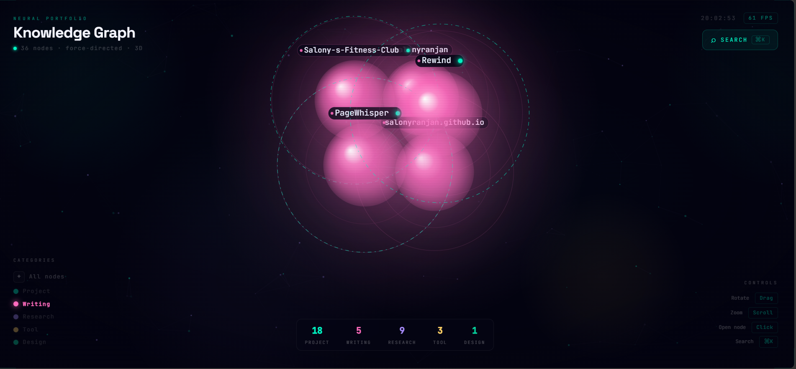
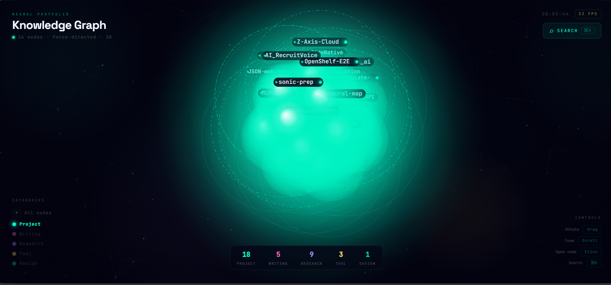
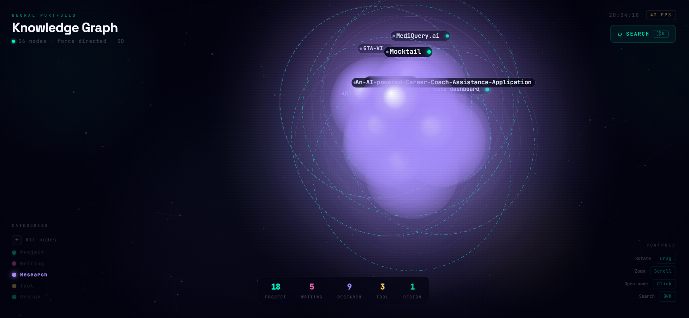
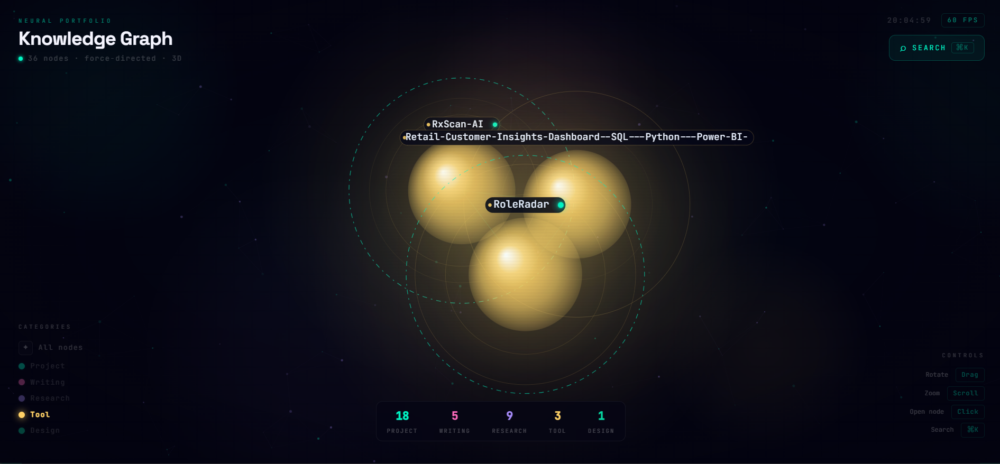
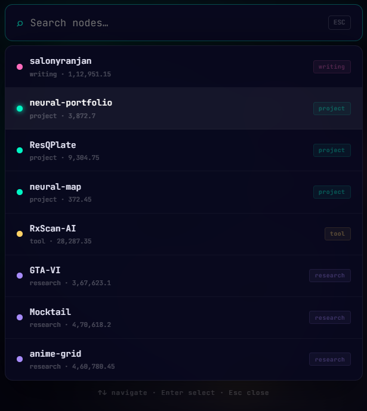
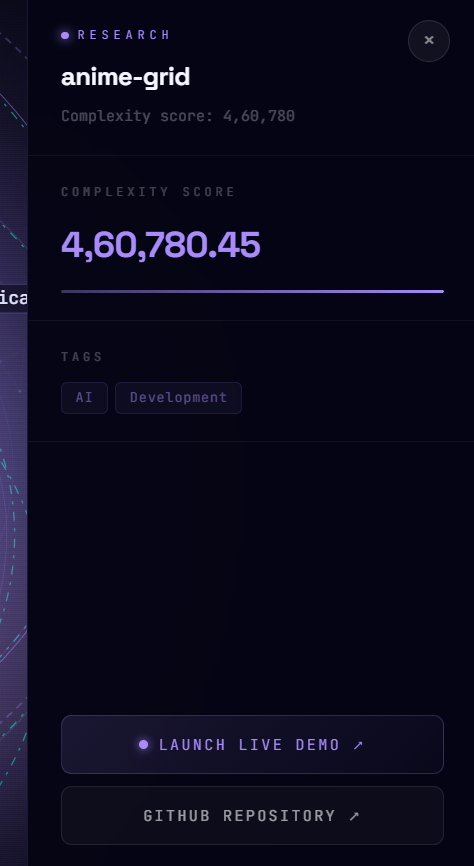
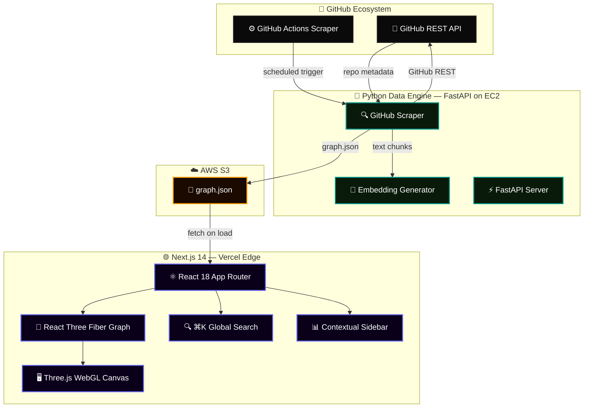
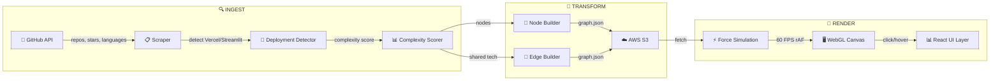
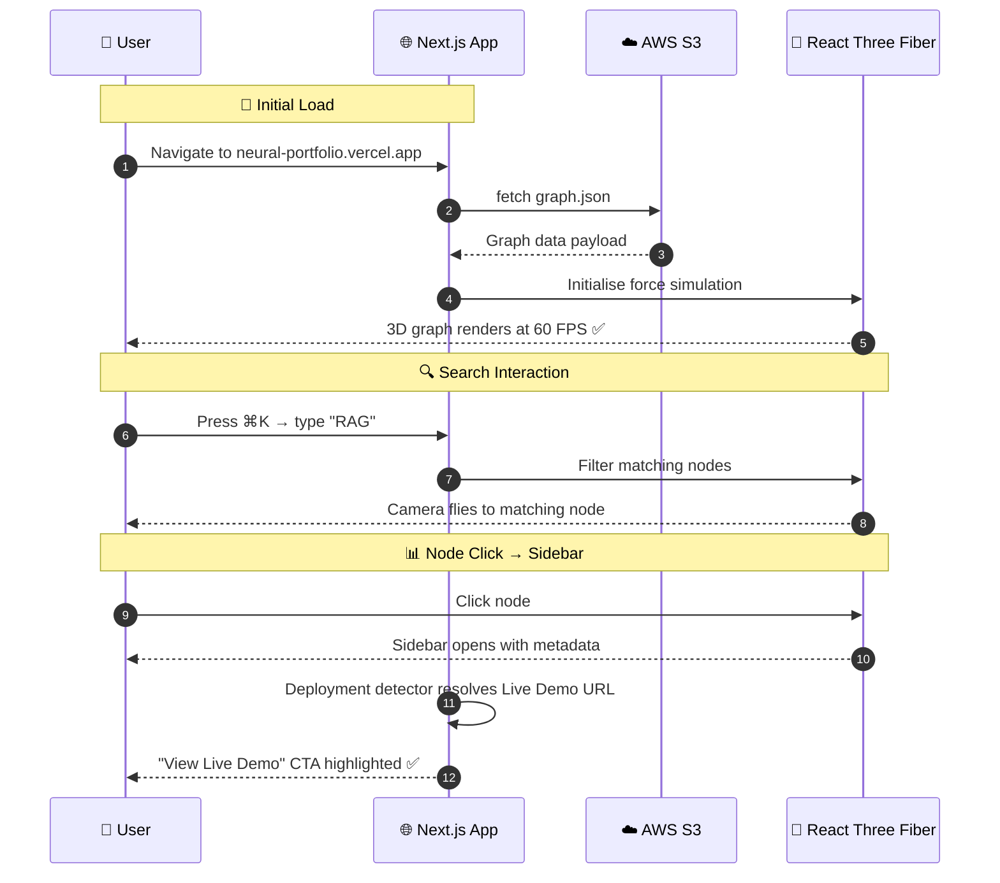

<div align="center">


<br/>

<a href="https://neural-portfolio.vercel.app/" target="_blank">
  
</a>

<br/><br/>


<br/>

[](https://github.com/salonyranjan/neural-portfolio/actions)
[](https://github.com/salonyranjan/neural-portfolio/releases)
[](LICENSE)
[](https://github.com/salonyranjan/neural-portfolio/stargazers)


<br/><br/>

> *"Not a résumé. Not a portfolio site. A living, breathing 3D knowledge graph that lets recruiters explore the relationships between skills, projects, and complexity — in real time."*

<br/>

<a href="https://neural-portfolio.vercel.app/"></a>
&nbsp;
<a href="#-quick-start"></a>
&nbsp;
<a href="#%EF%B8%8F-architecture"></a>
&nbsp;
<a href="https://github.com/salonyranjan/neural-portfolio/stargazers"></a>

</div>

<br/>

## 📋 Table of Contents

1. [What is Neural Portfolio?](#-what-is-neural-portfolio)
2. [Visual Showcase](#%EF%B8%8F-visual-showcase)
3. [Key Features](#-key-features)
4. [Architecture](#%EF%B8%8F-architecture)
5. [Tech Stack](#%EF%B8%8F-tech-stack)
6. [Why I Built This](#-why-i-built-this)
7. [Project Structure](#-project-structure)
8. [Roadmap](#%EF%B8%8F-roadmap)
9. [Quick Start](#-quick-start)
10. [Deployment](#-deployment)
11. [Performance](#-performance)
12. [FAQ](#-faq)
13. [Contributing](#-contributing)
14. [Author](#-author)

---

## 🌌 What is Neural Portfolio?

**Neural Portfolio** turns a static résumé into a **live, force-directed 3D graph**. Every node is a repository, every edge is a shared technology, and node size scales with project complexity — all auto-synced from your GitHub activity, nightly, with zero manual updates.

> 🎯 **The insight:** recruiters don't just need a list of what you've built — they need to *feel* how deep your skills interconnect. A graph makes that obvious in three seconds flat.

<div align="center">

| 🔖 Release | 📦 Headline Features |
|:---:|:---|
| `v1.0.0` | 3D force-directed graph · Live GitHub sync · Smart deployment detection · ⌘K global search |

</div>

---

## 🖼️ Visual Showcase

<div align="center">

### The Knowledge Graph


 
 

<i>Orbit, pan, and zoom through a live force-directed graph with custom physics.</i>

<br/><br/>

<table>
<tr>
<td width="50%" align="center">

<br/><b>⌘K Global Search</b><br/>
<sub>Type a name, tech, or category — the camera flies straight to the node.</sub>
</td>
<td width="50%" align="center">

<br/><b>Contextual Sidebar</b><br/>
<sub>Tech stack, complexity score, and live-demo links on every click.</sub>
</td>
</tr>
</table>

</div>

**Responsive by design**

| View | 📱 Mobile | 💻 Tablet | 🖥️ Desktop |
|:---|:---:|:---:|:---:|
| 3D Graph | ✅ touch orbit | ✅ touch + mouse | ✅ full orbit |
| ⌘K Search | ✅ | ✅ | ✅ |
| Sidebar | ✅ bottom sheet | ✅ side panel | ✅ side panel |

---

## ✨ Key Features

| | Feature | Description |
|:---:|:---|:---|
| 🌌 | **Interactive 3D Graph** | Force-directed node physics with orbit, pan, and zoom — a custom `requestAnimationFrame` loop holds 60 FPS at any graph size |
| 🔗 | **Live GitHub Sync** | A Python scraper pulls repo metadata, stars, languages, and deployment URLs on a schedule via GitHub Actions |
| 🚀 | **Smart Deployment Detection** | Auto-detects Vercel and Streamlit URLs, surfacing "Live Demo" ahead of source code for recruiter-first UX |
| 📊 | **Complexity-Weighted Nodes** | Node size scales with a complexity score (LOC, tech diversity, stars) — hierarchy emerges without manual curation |
| 🎨 | **Distance-Based Edge Fading** | Edges fade as nodes separate, killing spaghetti-graph clutter at any zoom level |
| 🔍 | **⌘K Global Search** | Command-palette node finder — camera smoothly flies to the match |
| 📋 | **Contextual Sidebar** | Tech chips, complexity score, live demo link, GitHub stats, and an AI-generated summary on every click |
| 📱 | **Touch & Mobile Ready** | Pinch-to-zoom, swipe-to-orbit, tap-to-select — physics scales to mobile GPU budgets automatically |

---

## 🏗️ Architecture

### System Overview


```mermaid
graph TD
    subgraph GitHub ["🐙 GitHub Ecosystem"]
        GH_API[🔌 GitHub REST API]
        GH_ACT[⚙️ GitHub Actions Scraper]
    end

    subgraph Backend ["🐍 Python Data Engine — FastAPI on EC2"]
        SCRAPER[🔍 GitHub Scraper]
        EMBED[🧠 Embedding Generator]
        API[⚡ FastAPI Server]
    end

    subgraph Storage ["☁️ AWS S3"]
        JSON[📄 graph.json]
    end

    subgraph Frontend ["🌐 Next.js 14 — Vercel Edge"]
        APP[⚛️ React 18 App Router]
        R3F[🌌 React Three Fiber Graph]
        CANVAS[🖥️ Three.js WebGL Canvas]
        SEARCH[🔍 ⌘K Global Search]
        SIDEBAR[📊 Contextual Sidebar]
    end

    GH_ACT -->|scheduled trigger| SCRAPER
    SCRAPER -->|GitHub REST| GH_API
    GH_API -->|repo metadata| SCRAPER
    SCRAPER -->|graph.json| JSON
    SCRAPER -->|text chunks| EMBED

    JSON -->|fetch on load| APP
    APP --> R3F --> CANVAS
    APP --> SEARCH
    APP --> SIDEBAR

    classDef github fill:#0a0a0a,stroke:#181717,stroke-width:2px,color:#fff;
    classDef backend fill:#0a1a0a,stroke:#009688,stroke-width:2px,color:#fff;
    classDef storage fill:#1a0a00,stroke:#FF9900,stroke-width:2px,color:#fff;
    classDef frontend fill:#0a001a,stroke:#6366f1,stroke-width:2px,color:#fff;

    class GH_API,GH_ACT github;
    class SCRAPER,EMBED,API backend;
    class JSON storage;
    class APP,R3F,CANVAS,SEARCH,SIDEBAR frontend;
```

<details>
<summary><b>🔄 Data flow — GitHub → Graph</b></summary>


```mermaid
flowchart LR
    subgraph Ingest ["🔍 INGEST"]
        GH[🐙 GitHub API] -->|repos, stars, languages| SC[📋 Scraper]
        SC -->|detect Vercel/Streamlit| DD[🚀 Deployment Detector]
        DD -->|complexity score| CS[📊 Complexity Scorer]
    end

    subgraph Transform ["🔄 TRANSFORM"]
        CS -->|nodes| NB[🔵 Node Builder]
        CS -->|shared tech| EB[🔗 Edge Builder]
        NB & EB -->|graph.json| S3[☁️ AWS S3]
    end

    subgraph Render ["🌌 RENDER"]
        S3 -->|fetch| FD[⚡ Force Simulation]
        FD -->|60 FPS rAF| WGL[🖥️ WebGL Canvas]
        WGL -->|click/hover| UI[📊 React UI Layer]
    end
```

</details>

<details>
<summary><b>⚡ Render pipeline sequence</b></summary>


```mermaid
sequenceDiagram
    autonumber
    participant U as 👤 User
    participant FE as 🌐 Next.js App
    participant S3 as ☁️ AWS S3
    participant R3F as 🌌 React Three Fiber

    Note over U,FE: 🚀 Initial Load
    U->>FE: Navigate to neural-portfolio.vercel.app
    FE->>S3: fetch graph.json
    S3-->>FE: Graph data payload
    FE->>R3F: Initialise force simulation
    R3F-->>U: 3D graph renders at 60 FPS ✅

    Note over U,R3F: 🔍 Search Interaction
    U->>FE: Press ⌘K → type "RAG"
    FE->>R3F: Filter matching nodes
    R3F-->>U: Camera flies to matching node

    Note over U,R3F: 📊 Node Click → Sidebar
    U->>R3F: Click node
    R3F-->>U: Sidebar opens with metadata
    FE->>FE: Deployment detector resolves Live Demo URL
    FE-->>U: "View Live Demo" CTA highlighted ✅
```

</details>

---

## 🛠️ Tech Stack

<table>
<tr><td valign="top" width="33%">

**🌐 Frontend & 3D**
- Next.js 14 (App Router)
- React 18 (Concurrent)
- Three.js + React Three Fiber
- Custom `requestAnimationFrame` physics loop
- Distance-based edge fading
- ⌘K command-palette search

</td><td valign="top" width="33%">

**🐍 Backend & Data**
- FastAPI (async REST)
- Python GitHub scraper
- Deployment detector (Vercel/Streamlit)
- Complexity scorer (LOC + tech diversity + stars)
- Pinecone for AI insight retrieval

</td><td valign="top" width="33%">

**☁️ Cloud & DevOps**
- AWS S3 — hosts `graph.json`
- AWS EC2 — runs FastAPI
- Vercel Edge — frontend CDN
- GitHub Actions — nightly scraper CI

</td></tr>
</table>

---

## 🤔 Why I Built This

Static résumés are linear — they list projects sequentially but hide the signal that actually matters: **how skills and projects relate to each other.**

A flat list can't show that RAG pipelines, vector databases, and LLM tooling form a coherent specialization, or that the 3D web work shares a rendering philosophy with the geospatial and data-viz work. **Neural Portfolio makes those connections visible in three seconds.**

| 🔧 Problem | 💡 Solution |
|:---|:---|
| Spaghetti graphs at high node density | Distance-based edge fading + complexity-weighted scaling creates natural hierarchy |
| Stale deployment links — GitHub doesn't track "where it's live" | A deployment detector parses README + repo topics to surface live URLs automatically |
| 60 FPS with 50+ nodes — force simulation is expensive | A custom `requestAnimationFrame` loop decoupled from React's render cycle |

---

## 📂 Project Structure

```
neural-portfolio/
├── .github/workflows/
│   └── update-data.yml        # Nightly GitHub Action (scraper)
├── assets/                    # Demo media & screenshots
├── data-engine/                # Python data pipeline
│   ├── fetcher.py              # GitHub API scraper
│   └── requirements.txt
├── frontend/                   # Next.js 14 app
│   ├── app/
│   │   ├── layout.tsx           # Global layout & SEO
│   │   └── page.tsx             # Root 3D interface
│   ├── components/
│   │   ├── Graph.tsx            # Force-directed simulation
│   │   └── Scene.tsx            # 3D canvas & R3F setup
│   └── data/
│       └── portfolio-data.json  # Auto-synced GitHub metadata
└── README.md
```

---

## 🗺️ Roadmap

- [x] 3D force-directed knowledge graph
- [x] GitHub API live sync + deployment detection
- [x] Complexity-weighted node scaling + edge fading
- [x] ⌘K global search with camera fly-to
- [x] GitHub Actions nightly scraper
- [ ] **LLM auto-summaries** — project descriptions generated on hover
- [ ] **Social graph** — ingest LinkedIn activity into a unified map
- [ ] **Dedicated touch gestures** — haptic node selection
- [ ] **Skill clustering** — auto-group nodes by technology domain
- [ ] **Timeline mode** — chronological commit-activity view
- [ ] **Recruiter share link** — filtered, shareable graph URL
- [ ] **Dark / light theme toggle**
- [ ] 💡 AR mode via WebXR
- [ ] 💡 Voice navigation ("show me RAG projects")

> 💬 [Open a feature request →](https://github.com/salonyranjan/neural-portfolio/issues/new)

---

## 📦 Quick Start

**Prerequisites:** Node.js ≥ 18, Python ≥ 3.10, Git, a [GitHub token](https://github.com/settings/tokens)

```bash
# 1. Clone
git clone https://github.com/salonyranjan/neural-portfolio.git
cd neural-portfolio

# 2. Backend
cd backend
python -m venv venv && source venv/bin/activate   # Windows: venv\Scripts\activate
pip install -r requirements.txt

# 3. Frontend
cd ../frontend
npm install
```

**Configure secrets** — create `backend/.env`:

```env
GITHUB_TOKEN=your_github_personal_access_token
GITHUB_USERNAME=salonyranjan
AWS_ACCESS_KEY_ID=your_access_key
AWS_SECRET_ACCESS_KEY=your_secret_key
AWS_S3_BUCKET=your-bucket-name
AWS_REGION=us-east-1
```

and `frontend/.env.local`:

```env
NEXT_PUBLIC_GRAPH_URL=https://your-bucket.s3.amazonaws.com/graph.json
NEXT_PUBLIC_API_BASE_URL=http://localhost:8000
```

> 🔐 Both files are git-ignored — never commit real tokens.

**Run it:**

```bash
# Generate graph.json
python scraper/github_scraper.py

# Start the API
uvicorn main:app --reload --port 8000        # → localhost:8000/docs

# Start the frontend
npm run dev                                   # → localhost:3000
```

---

## 🚀 Deployment

**Frontend → Vercel:** push `frontend/` to GitHub, import at [vercel.com/new](https://vercel.com/new), set root directory to `frontend/`, add env vars, deploy. Auto-redeploys on every push.

**Backend → AWS EC2:**
```bash
git clone https://github.com/salonyranjan/neural-portfolio.git
cd neural-portfolio/backend
pip install -r requirements.txt
gunicorn main:app -w 4 -k uvicorn.workers.UvicornWorker -b 0.0.0.0:8000
```
> ⚠️ Open port 8000 in your EC2 Security Group and point `NEXT_PUBLIC_API_BASE_URL` to the EC2 public IP.

**Nightly scraper → GitHub Actions:** `.github/workflows/scraper.yml` runs at 02:00 UTC, refreshes `graph.json` on S3, and triggers a Vercel redeploy.

---

## ⚡ Performance

| Metric | Value | How |
|:---|:---:|:---|
| Graph FPS | `60 FPS` | Custom rAF loop decoupled from React's render cycle |
| Initial Load | `< 1.5s` | S3-hosted `graph.json` + Vercel edge CDN |
| Search Response | `< 50ms` | Client-side node filtering + smooth camera tween |
| Bundle Size | Minimised | Next.js code-splitting + Three.js tree-shaking |
| SEO Score | `100` | Static metadata, Open Graph, structured data |

---

## ❓ FAQ

<details>
<summary><b>How often does the graph sync with GitHub?</b></summary><br/>

Nightly, at 02:00 UTC via GitHub Actions — or trigger a manual run from the Actions tab after pushing a major project. The frontend fetches `graph.json` fresh on every page load.
</details>

<details>
<summary><b>How does Smart Deployment Detection work?</b></summary><br/>

`deployment_detector.py` checks three sources per repo: the `homepage` field, README URL patterns, and repo topics (`vercel-deployed`, `streamlit-app`). Any match gets promoted to the primary CTA in the sidebar, above the source link.
</details>

<details>
<summary><b>Why decouple the physics loop from React?</b></summary><br/>

React's render cycle can be delayed by state updates and re-renders. Running the force simulation in a native `requestAnimationFrame` callback (not `useEffect`) keeps physics ticking every frame regardless of React's workload — so the graph stays smooth even mid-interaction.
</details>

<details>
<summary><b>Why Pinecone instead of a local vector store?</b></summary><br/>

Sub-20ms ANN lookups with zero infrastructure to manage. The free tier comfortably handles a portfolio's worth of repository embeddings. ChromaDB or FAISS work fine as self-hosted alternatives.
</details>

---

## 🤝 Contributing

```bash
git checkout -b feature/your-feature
git commit -m "feat: add your feature"   # fix: | docs: | style: | refactor: | test: | chore:
git push origin feature/your-feature
```

**Priority areas:** touch UX (pinch/swipe/haptics) · LLM-generated summaries · light/dark theme system · Vitest coverage for the scraper and graph builder.

---

## 👤 Author

<table style="border:none;">
  <tr>
    <td align="center" style="border:none;" width="150">
      
    </td>
    <td style="border:none; padding-left:22px;">
      <h3>✦ Salony Ranjan</h3>
      <p><em>"A résumé tells you what I've built. A knowledge graph shows you how it all connects."</em></p>
      <br/>
      <a href="https://www.linkedin.com/in/salony-ranjan-b63200280/"></a>
      &nbsp;
      <a href="https://github.com/salonyranjan"></a>
      &nbsp;
      <a href="mailto:salonyranjan@gmail.com"></a>
      &nbsp;
      <a href="https://neural-portfolio.vercel.app/"></a>
    </td>
  </tr>
</table>

---

<div align="center">

### ⭐ If this changed how you think about a developer portfolio — star it

<br/><br/>

<a href="https://github.com/salonyranjan/neural-portfolio/stargazers"></a>
&nbsp;
<a href="https://github.com/salonyranjan/neural-portfolio/fork"></a>
&nbsp;
<a href="https://neural-portfolio.vercel.app/"></a>
&nbsp;
<a href="https://github.com/salonyranjan/neural-portfolio/issues/new"></a>

<br/><br/>


*Built with* 🌌 *by* [**Salony Ranjan**](https://github.com/salonyranjan) &nbsp;·&nbsp; *© 2026 · MIT License*


</div>
