<div align="center">
  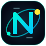
  <h1>Neural Portfolio</h1>
  <p><strong>Engineering in Orbit</strong></p>
</div>

A developer portfolio arranged as a solar system. Color-coded project orbits, a luminous sun, and perspective rendering connect the visual language of physics with a software engineering journey.

## Visual experience

### Explore the system

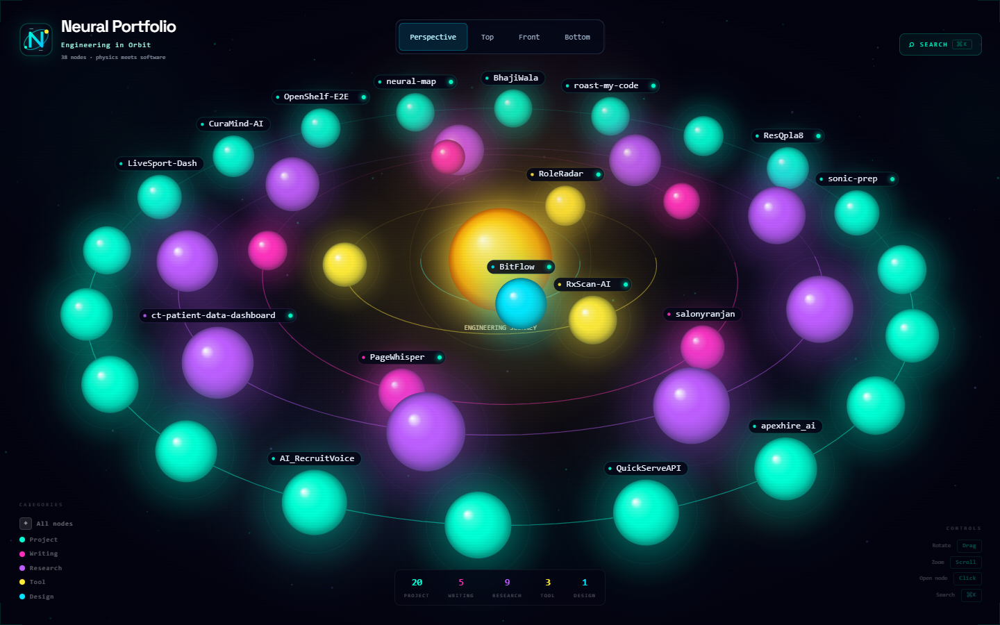

Neon category orbits surround a luminous sun. Orbital motion and energy pulses respect reduced-motion preferences.

### Camera views

Switch between **Perspective, Top, Front, and Bottom** views. Drag to rotate and scroll to zoom.

<table>
  <tr>
    <th width="33%">Top</th>
    <th width="33%">Front</th>
    <th width="33%">Bottom</th>
  </tr>
  <tr>
    <td>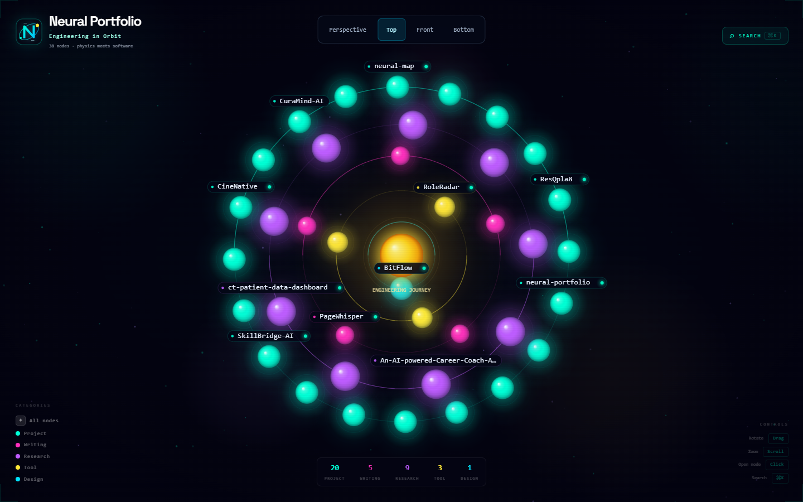</td>
    <td>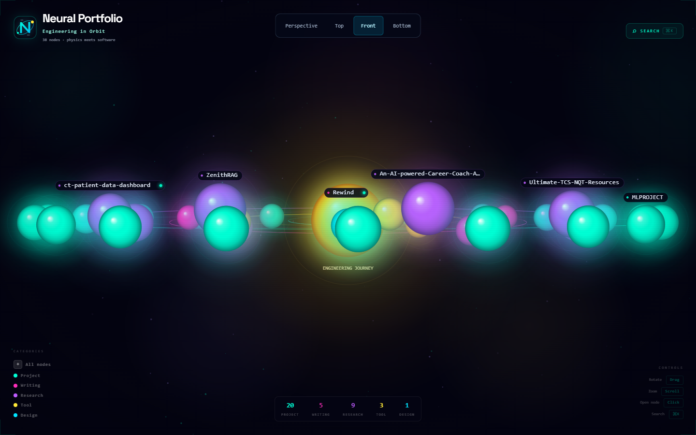</td>
    <td>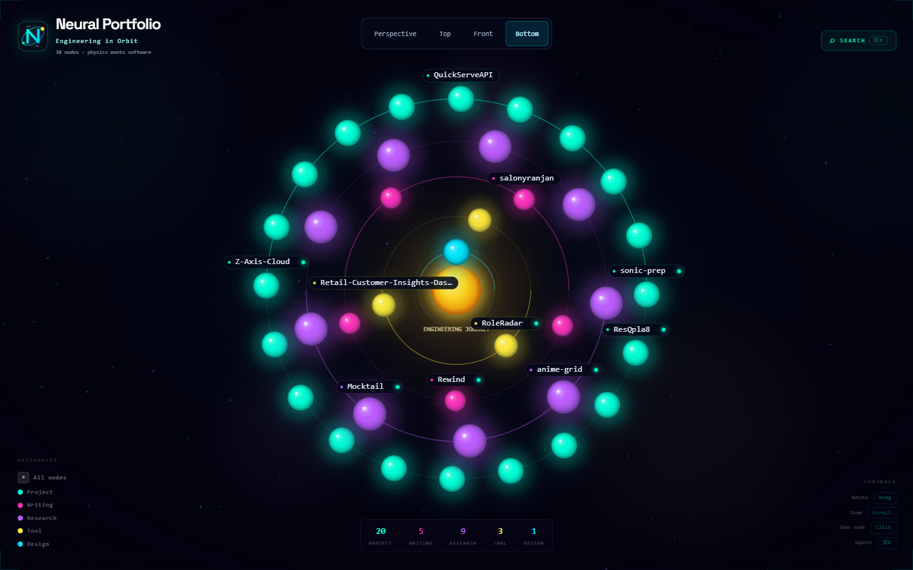</td>
  </tr>
</table>

### Category filtering

Each color identifies a category on its own orbit. Select a category to focus on its nodes; **All nodes** restores the complete system.

<table>
  <tr>
    <th width="50%">Projects · Neon green</th>
    <th width="50%">Research · Violet</th>
  </tr>
  <tr>
    <td>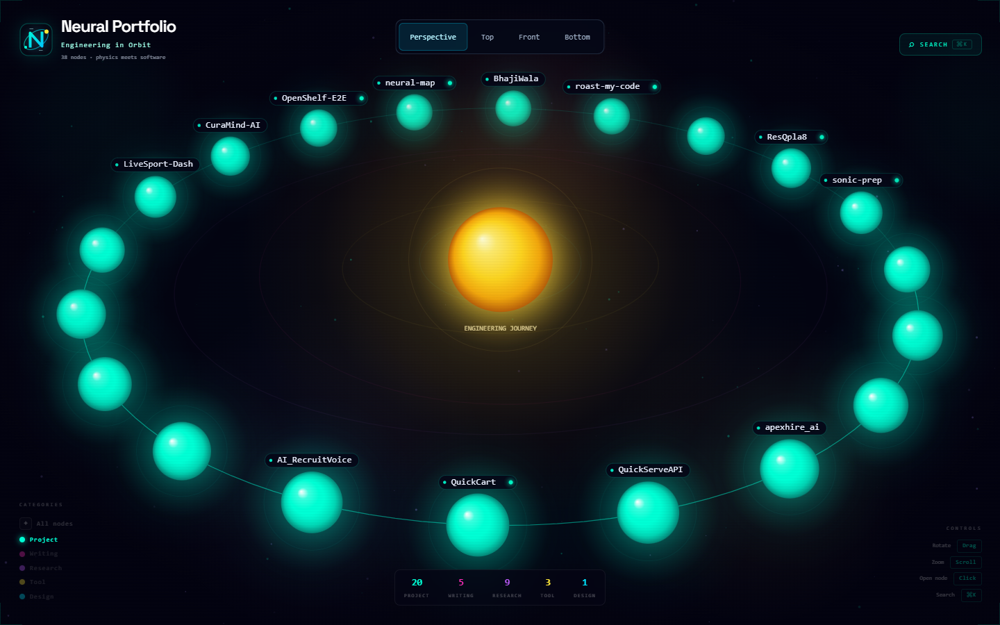</td>
    <td>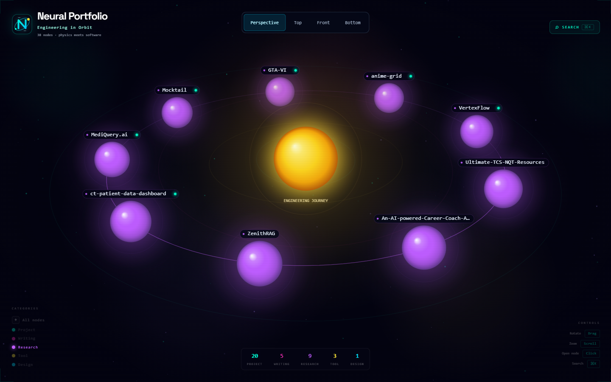</td>
  </tr>
  <tr>
    <th>Writing · Electric pink</th>
    <th>Tools · Bright yellow</th>
  </tr>
  <tr>
    <td>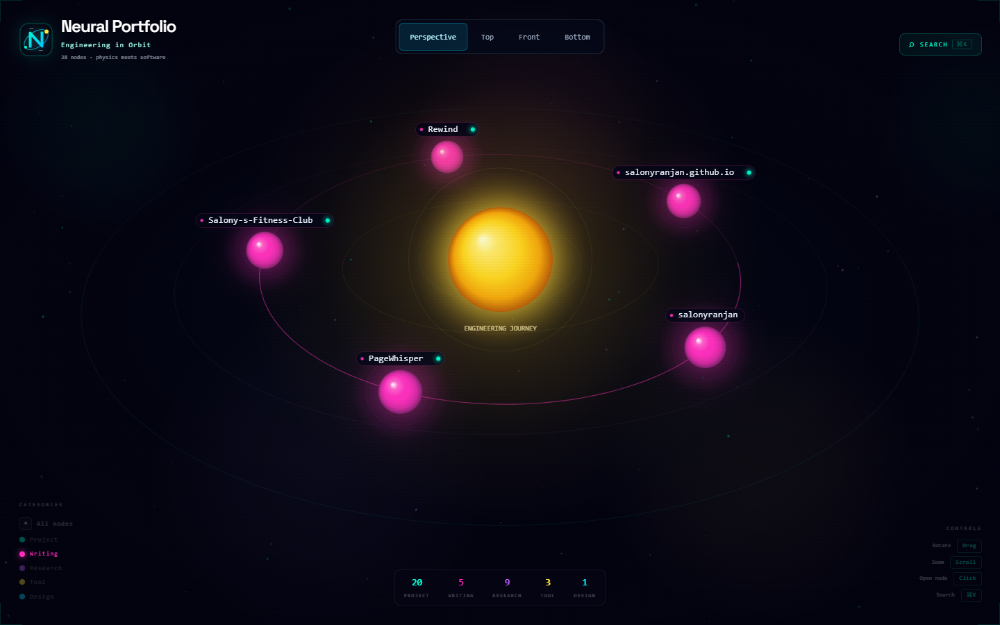</td>
    <td>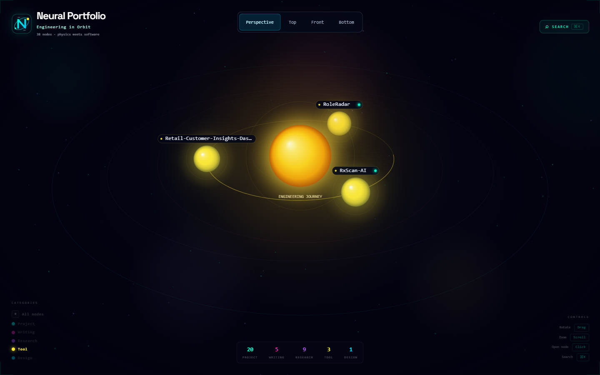</td>
  </tr>
  <tr>
    <th colspan="2">Design · Cyan</th>
  </tr>
  <tr>
    <td colspan="2" align="center">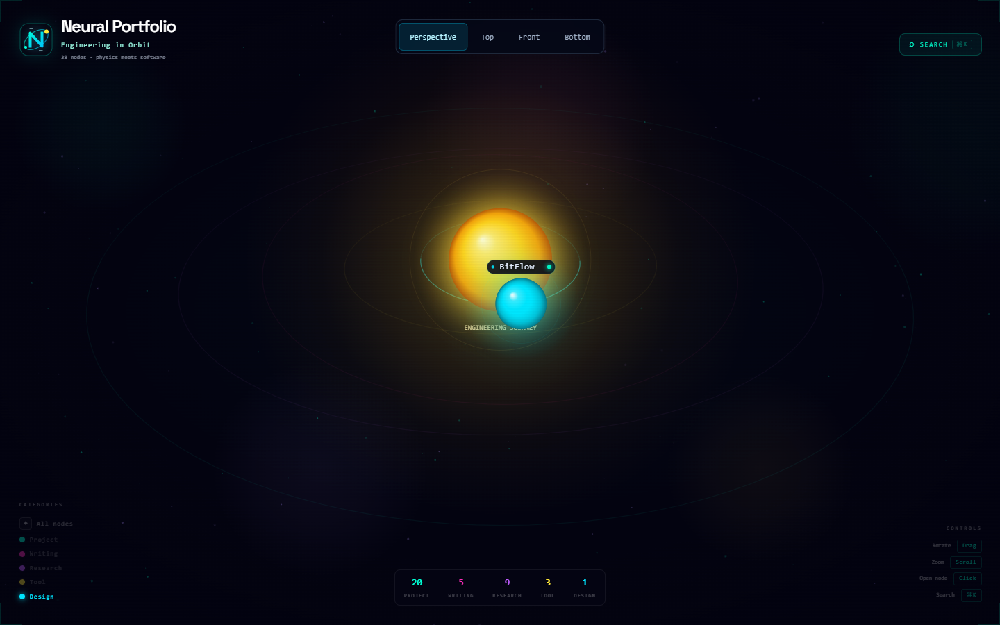</td>
  </tr>
</table>

### Project search

Search by name or category with **Ctrl+K / Cmd+K**, then use the arrow keys and Enter to select a result.

<p align="center">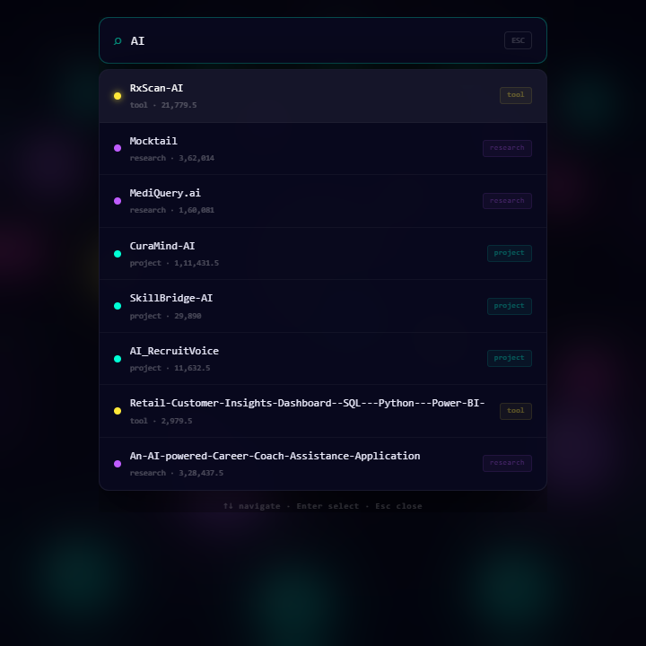</p>

### Project details

Inspect a project's complexity score and open its repository or an available demo.

<p align="center">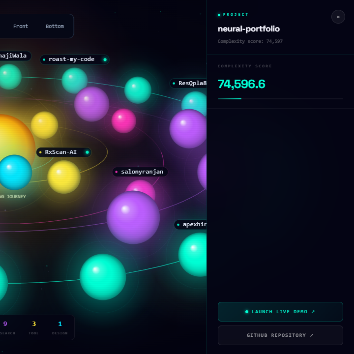</p>

### Mobile experience

Portrait framing and category controls adapt to smaller screens. Tap to inspect a project, swipe to rotate, or choose a camera preset.

<p align="center">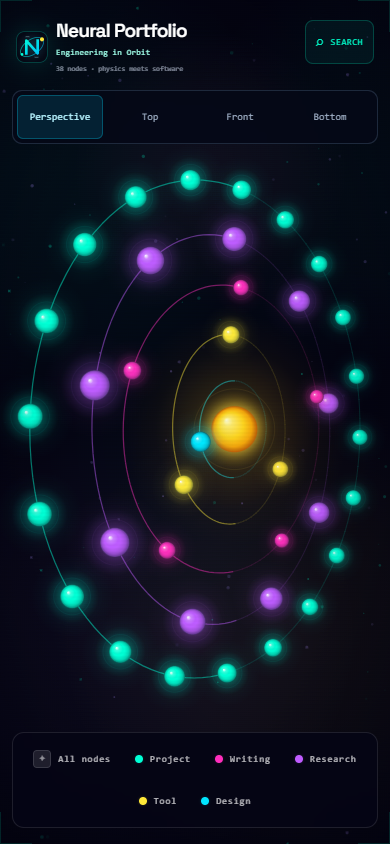</p>

Screenshots show the current local implementation with reduced motion enabled; desktop clock/FPS diagnostics are hidden for clarity.

## Run locally

Requires Node.js 20+ and npm. From the repository root:

```bash
cd frontend
npm ci
npm run dev
```

Open [localhost:3000](http://localhost:3000). Run `npm run build` to generate the static site in `frontend/out/`, ready for static hosting.

Run `npm run typecheck` in `frontend` for strict TypeScript checks. From the repository root, run `python -m unittest discover -s data-engine/tests` to verify the optional data updater without GitHub credentials.

## Implementation

**Next.js 15 · React 19 · TypeScript · Canvas 2D**

The renderer projects 3D orbital coordinates onto a canvas and animates them with `requestAnimationFrame`. The frontend imports its portfolio data at build time and runs without a separate API server.

## Portfolio data

- Edit [`portfolio-data.json`](./frontend/data/portfolio-data.json) to update project names, scores, repository URLs, and `demoUrl` values. Complexity scores are estimates, not code-quality ratings; planet size is determined by category and perspective.
- The optional [`fetcher.py`](./data-engine/fetcher.py) reads public GitHub repositories and homepage URLs. The included [daily workflow](./.github/workflows/update-data.yml) requires the `MY_PERSONAL_TOKEN` repository secret; refreshed data appears after rebuilding the frontend.
- [`unavailable-demo-urls.json`](./frontend/data/unavailable-demo-urls.json) suppresses known failing demo actions while keeping repository links available. Remove an entry after its demo service recovers.

Built by [Salony Ranjan](https://github.com/salonyranjan). Licensed under [MIT](./LICENSE).
